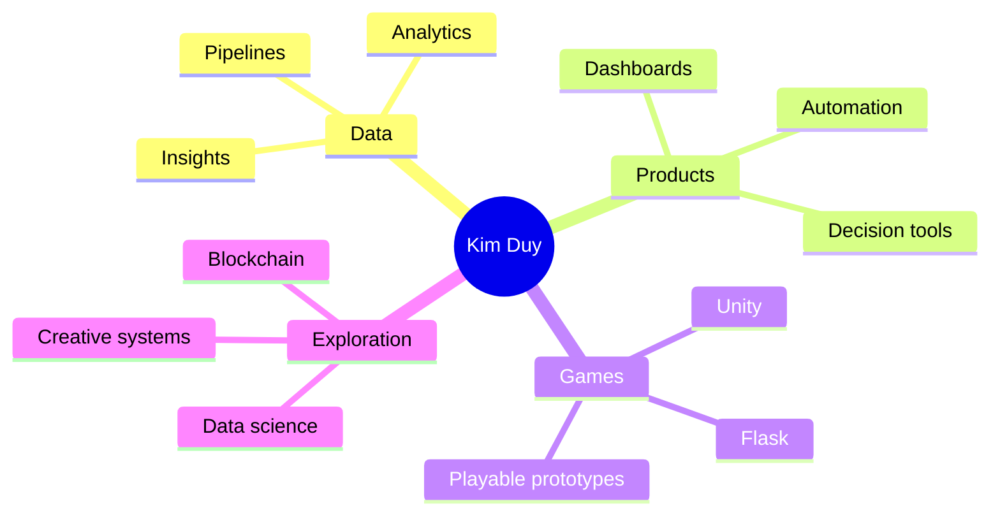

<p align="center">
  
</p>

<p align="center">
  <a href="https://www.linkedin.com/in/duynguyenkim">
    
  </a>
  <a href="mailto:nguyenkduywork@gmail.com">
    
  </a>
  <a href="https://nguyenkduy.itch.io">
    
  </a>
</p>

<p align="center">
  
</p>

---

## About Me

I am an **Analytics Engineer at DigitaLinkers - Equancy**, focused on data engineering, analytics engineering, data science, and decision-oriented analysis.

I like building high-performance **ELT / ETL pipelines**, designing clean analytical models, and turning messy information into useful insight. Outside work, I experiment with **Unity**, **Python / Flask web games**, and blockchain technologies.

```txt
Current mode
├─ building reliable data workflows
├─ making analytics easier to trust
├─ exploring game systems and interactive experiences
└─ learning where data, products, and creativity overlap
```

## Tech Stack

<p align="center">
  
</p>

<p align="center">
  
  
  
  
  
</p>

## What I Like Building

| Area | What I enjoy |
| --- | --- |
| Data Engineering | Robust pipelines, clean transformations, automation, performance tuning |
| Analytics | Dashboards, metrics, storytelling, business-friendly insights |
| Data Science | Exploration, modeling, experimentation, useful prediction |
| Game Development | Playable systems, mechanics, Unity prototypes, Flask-based web games |
| Blockchain | Decentralized systems, smart contract ideas, product opportunities |

## GitHub Pulse

<p align="center">
  
  
</p>

<p align="center">
  
</p>

<p align="center">
  
</p>

## Contribution Snake

<p align="center">
  <picture>
    <source media="(prefers-color-scheme: dark)" srcset="https://raw.githubusercontent.com/nguyenkduywork/nguyenkduywork/output/github-contribution-grid-snake-dark.svg" />
    <source media="(prefers-color-scheme: light)" srcset="https://raw.githubusercontent.com/nguyenkduywork/nguyenkduywork/output/github-contribution-grid-snake.svg" />
    
  </picture>
</p>

## Featured Direction



## Let's Connect

I am always happy to talk about data systems, analytics engineering, game ideas, blockchain experiments, or projects where technical depth meets creativity.

<p align="center">
  <a href="https://www.linkedin.com/in/duynguyenkim">
    
  </a>
  <a href="mailto:nguyenkduywork@gmail.com">
    
  </a>
</p>

<p align="center">
  
</p>
